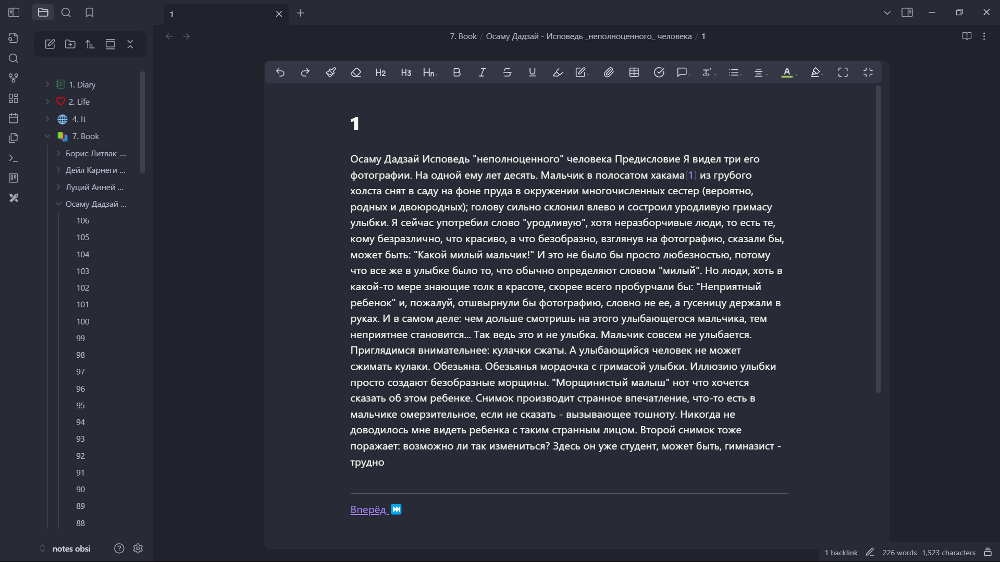

# FB2 to Obsidian Markdown Converter (Booker)

📚 A simple script to convert `.fb2` books into folders of Markdown files optimized for reading in [Obsidian](https://obsidian.md).
Each page of the book is saved as a separate `.md` file with built-in **next/previous** navigation.

---

## 🤔 Why?

I spent a long time searching for a comfortable book reader with sync between devices — but found nothing that fully suited me.
That’s when the idea came: create a script that transforms `.fb2` books into a structure that Obsidian can work with.

Now I can read books **directly inside Obsidian**, with smooth page-by-page navigation and full control.

---

## 🔧 Features

- Automatically scans for all `.fb2` files in the current folder
- Extracts book title and author from metadata
- Creates a separate folder for each book
- Splits the content into fixed-length pages
- Generates Markdown files with forward/backward navigation links

---

## 🖼 Example output

_A sample book displayed in Obsidian:_



---

## 🚀 Installation & Usage

1. Make sure you have **Python 3.7+** installed.
2. Install dependencies and run the script:

```bash
uv sync
uv run main.py
```
